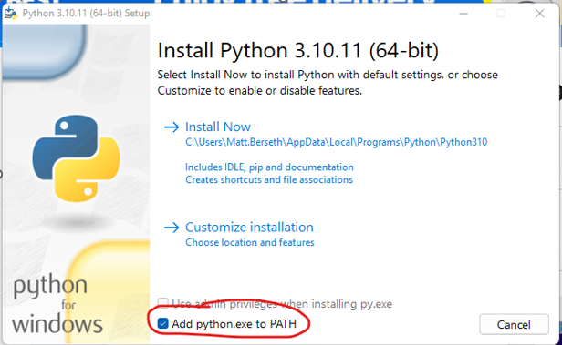
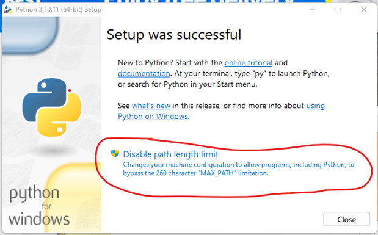
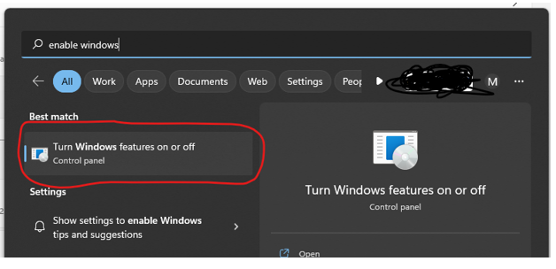
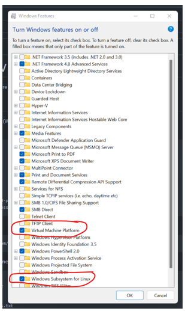
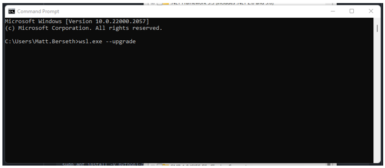
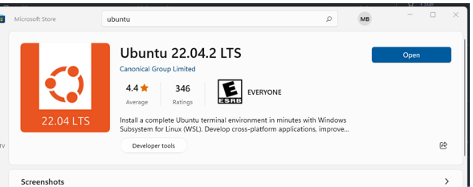

# cs451-101Z-ENV
Follow the instructions to ensure you have the computing environment configured properly.

## Notes
1. If you are using Windows, please install GitHub Desktop (https://desktop.github.com/)

1. After you configure your environment, you can launch vscode and install two extensions (Python, Pylance)

1. Once everything is set up, you can set a breakpoint in main.py and debug the script.


## Windows 10/11 Steps
1. Download the Python3.10.11 windows installer here: https://www.python.org/ftp/python/3.10.11/python-3.10.11-amd64.exe

1. Double click on the downloaded file and install Python for all users. **Ensure that Python is added to your path.**



1. Open a new powershell window and execute the following commands.
```powershell
# clone the repo
git clone https://github.com/matt-berseth/cs451-101Z-ENV.git

# path into the new codebase
cd cs451-101Z-ENV

# create a virtual environment
python3.10 -m venv .venv

# activate virtual environment
.\.venv\Scripts\activate.ps1

# upgrade pip
python -m pip install --upgrade pip

# install requirements
pip install -r requirements.txt

# launch vscode
code .
```

## Ubuntu 22.04.2 Steps
1. Open the Windows Control Panel and click 'Turn Windows features on or off'


1. Enable 'Windows Subsystem for Linux' and 'Virtual Machine Platform'. Reboot after clicking these two options.


1. Upgrade wsl by opening a windows command prompt and entering `wsl.exe --upgrade`


1. Install Ubuntu 22.04.02 LTS from the Store
.

1. The first time you launch ubuntu you will need to configure a username and password. **You will need to remember this username and password**


1. From the wsl terminal, run the following commands
```bash
# launch a WSL window
sudo apt update
sudo apt -y upgrade

# confirm python 3.10
python3 -V

# install python dev tools
sudo apt install -y python3-pip
sudo apt install -y build-essential libssl-dev libffi-dev python3-dev

# clone the repo
git clone https://github.com/matt-berseth/cs451-101Z-ENV.git

# path into the new codebase
cd cs451-101Z-ENV

# create and enter virtual environment
python3 -m venv .venv
source ./.venv/bin/activate

# install requirements
pip install --upgrade pip
pip install -r requirements.txt

# launch vscode
code .
```

1. Install the following vscode packages (Python, Pylance)
1. Launch the 'main' entry.
